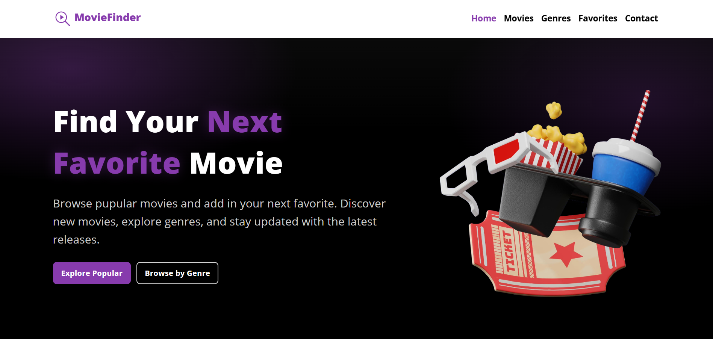

# MovieFinder — React SPA

Find your next favorite film. Browse **popular** movies, filter by **genres**, view rich **details** (with an inline trailer modal), save **favorites** to local storage, and **export** your list — all in a fast, accessible single-page app.



---

## ✨ Features

- **Home**: Hero, feature highlights, trending genres, spotlight picks.
- **Movies**: Popular list + **search** with debounced input, **pagination**, empty-state message.
- **Genres**: Filter by TMDB genres (with pagination); “All” shows Popular.
- **Movie Details**:
  - Backdrop hero + poster panel
  - **Play overlay** on poster → opens a **YouTube trailer** in a modal
  - Tagline, year, runtime, rating chips; genre pills; overview; extra facts
  - Add/Remove **Favorites**
- **Favorites**: LocalStorage-backed watchlist with **download (.json)**.
- **Contact**: Themed form with **inline validation** and accessible errors.
- **404**: Themed not-found with helpful actions.
- **Theming**: Dark UI with accent **#873bad**; consistent surfaces/borders/shadows.
- **A11y**: Landmarks, labels, focus rings, color contrast; ARIA where it helps.
- **SEO (minimal)**: Per-page `title` and `meta description` via `react-helmet-async`.

---

## 🧱 Tech Stack

- **React** (Router v6)
- **React-Bootstrap** (Navbar, Modal, Container)
- **Axios** (TMDB API)
- **LocalStorage** (Favorites)
- **react-helmet-async** (Page titles & descriptions)
- **CSS** modules per page/component (tokens via CSS variables)
  
> This product uses the **TMDB API** but is **not endorsed or certified by TMDB**. TMDB provides metadata & images — not full movie streams.

---

## 🚀 Getting Started

### 1) Requirements
- Node.js 18+ and npm (or pnpm/yarn)

### 2) Install
```bash
npm install
# or: npm install --f / yarn
```

### 3) Environment Variables
Create a `.env` in the project root (not committed):

```env
# TMDB
REACT_APP_TMDB_BASE_URL=https://api.themoviedb.org/3
REACT_APP_TMDB_KEY=<<your_tmdb_api_key>>
REACT_APP_TMDB_ACCESS_TOKEN=<<your_v4_read_access_token>>

# Optional: app base URL for images (we use TMDB's static base in code)
```

> Get your free TMDB API key and v4 access token from your TMDB account settings (create a project → generate API Read Access Tokens).

### 4) Start
```bash
npm start
```
- App runs at http://localhost:3000

### 5) Build
```bash
npm run build
```
- Output in `build/` (ready for Netlify, Vercel, GitHub Pages, etc.)

---

## 🔧 Project Structure (high-level)

```
src/
  api/
    tmdb.js                # Axios + endpoints + helpers (img())
  components/
    Button/
    Loader/
    MovieCard/
    Paginator/
    Trailer/
  pages/
    Home/
    Movies/
    Genres/
    MovieDetails/
    Favorites/
    Contact/
    NotFound/
  seo/
    Seo.jsx
    config.js
  App.jsx
  index.js
public/
  assets/
    images/
    logo/
```

---

## 🔑 TMDB API Usage

- Auth:
  - **Bearer**: `REACT_APP_TMDB_ACCESS_TOKEN` in headers
  - **api_key** query param: `REACT_APP_TMDB_KEY` (TMDB still accepts it alongside Bearer)
- Endpoints used:
  - `/movie/popular`, `/movie/top_rated`, `/movie/upcoming`
  - `/search/movie`
  - `/genre/movie/list`
  - `/discover/movie?with_genres={id}`
  - `/movie/{id}`, `/movie/{id}/videos`
- Images:
  - Posters/backdrops via `https://image.tmdb.org/t/p/{size}{path}` (`w342`, `w500`, `w780`, `w1280`)

---

## 🎨 Theming (CSS tokens)

In your global CSS (e.g., `index.css`), define tokens:

```css
:root {
  --bg: #08080b;
  --text: #ffffff;
  --muted: #b9c0cc;
  --surface: #0e0e14;
  --border: #1f2030;
  --radius: 16px;
  --radius-8: 12px;
  --shadow: 0 10px 28px rgba(0, 0, 0, 0.35);
  --accent: #873bad;
  --accent-400: #a86ccc;
  --accent-600: #692c88;
}
```

All pages/components reference these tokens for a consistent look.

---

## 🧭 Routing

- `/` — Home
- `/movies` — Movies (popular + search; pagination)
- `/genres` — Genres (select list; “All” = popular; pagination)
- `/movie/:id` — Movie Details (poster overlay play → **trailer modal**)
- `/favorites` — Favorites (localStorage list; **download JSON**)
- `/contact` — Contact form (inline errors)
- `*` — 404 Not Found

---

## ❤️ Favorites Data Shape

We **store the app-mapped movie object** (not raw TMDB):

```json
{
  "id": "603692",
  "title": "John Wick: Chapter 4",
  "year": "2023",
  "genre": ["Action", "Thriller"],
  "rating": 7.9,
  "poster": "https://image.tmdb.org/t/p/w342/....jpg",
  "overview": "..."
}
```

This ensures Favorites renders correctly even if the TMDB API changes.

---

## 🧩 UI Components

- **Navbar** (React-Bootstrap)
- **MovieCard**
- **Paginator**
- **Loader**
- **Trailer Modal** (YouTube + Bootstrap Modal)

> Import Bootstrap CSS once:
> ```js
> import 'bootstrap/dist/css/bootstrap.min.css';
> ```

---

## 🔍 Minimal SEO

Install:
```bash
npm i react-helmet-async
```
Add (example — Movies):
```jsx
import { Helmet } from "react-helmet-async";

<Helmet>
  <title>Popular Movies — MovieFinder</title>
  <meta name="description" content="Trending popular movies. Browse details and save your favorites." />
</Helmet>
```

---

## 🛠️ Troubleshooting

- Router v6: use `Routes`/`Route`, not `Switch`.
- Active nav color: override `.navbar .nav-link.active` after Bootstrap.
- Fonts not showing: confirm Google Fonts link + family names.
- Pointer/hover: ensure no overlay/pointer-events issues.
- Favorites empty poster: store mapped movie (with `poster` URL).

---

## 🔒 Security & Keys

- Don’t commit `.env`.
- Add env vars to your hosting provider (Netlify/Vercel).

---

## 📦 Deploy

- **Netlify** or **Vercel**: connect repo, add envs, deploy.

---

## 🙏 Acknowledgements

- **TMDB** (not endorsed/certified; metadata & images only).
- **React-Bootstrap**.

---

## 📄 License

MIT © 2025 Your Name

## 🧑‍💻 Developed By
[Kishan Kumar Das](https://kishankumardas.com) | [GitHub](https://github.com/kishankumar2607) | [LinkedIn](https://www.linkedin.com/in/kishan-kumar-das/)
